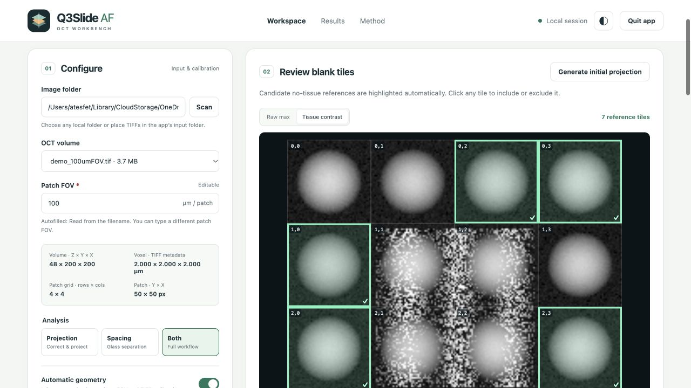

# Q3Slide AF v1

A local OCT workbench for reviewing blank reference tiles, reducing coverslip signal, aligning depth, projecting tissue, and measuring glass-to-glass spacing.



## Launch

Download or clone this repository into a writable folder, extract the ZIP if needed, then open the launcher for your system:

| System | Launcher |
| --- | --- |
| macOS (Apple Silicon or Intel) | Double-click **Start.command** |
| Windows 10/11 (64-bit) | Double-click **Start.bat** |
| Linux (x86_64 or ARM64) | Open **Start.desktop**, or execute **Start.sh** |

The first launch creates a dedicated Conda environment in `.runtime/env`, installs all required packages, verifies imports, starts the server, and opens the browser. If Conda is unavailable, the launcher downloads the official [Miniforge installer](https://github.com/conda-forge/miniforge), verifies its SHA-256 checksum, and installs it inside `.runtime/miniforge`. No administrator privileges or system Python changes are needed. Internet access is required for first setup and dependency updates. Subsequent launches reuse the environment.

Operating systems can require one initial trust step for downloaded launchers. On macOS, use **Open** from the context menu if Gatekeeper blocks a downloaded file. On Linux, mark the desktop launcher as trusted/executable in your file manager; if necessary run `chmod +x Start.sh Start.desktop` then `./Start.sh`. Some Linux file managers do not execute shell scripts on double-click. On Windows, keep PowerShell available; the `.bat` launcher applies its execution-policy setting only to the launched PowerShell process. For Miniforge installation, prefer a short folder path without special characters.

Do not open `index.html` directly. The launchers serve the app at a local address such as `http://127.0.0.1:8765`. **Quit app** stops the server and active processing. Closing only the browser tab leaves the server running; Ctrl+C in the launcher terminal also stops it.

## Process an image

1. Click **Browse image…** to select an uncompressed ImageJ TIFF Z stack using your system file chooser, or **Browse folder…** to list TIFFs from a folder. You can also place TIFFs in `input/`, or enter a folder path and click **Scan**. Browsing opens a dialog on the computer running the server; it does not upload or copy the scan.
2. Select a volume and confirm **Patch FOV**. It is autofilled from a filename containing `700umFOV` or `1mmFOV`, or defaults to 700 µm. It remains editable and is the FOV of one acquisition patch.
3. Click **Generate initial projection**. The mosaic highlights automatic candidate blank tiles. Click tiles to include/exclude them, use **Tissue contrast** for another view, or restore the automatic selection. Choose at least two no-tissue references.
4. Choose **Projection**, **Spacing**, or **Both**, then **Run analysis**. Reviewing references is optional; without a preview the original full-volume automatic selection runs.
5. Inspect the large QC images and selected-original/corrected audit outputs before using the final TIFF. Click any QC image to enlarge it. The output-folder setting is under **Advanced parameters**.

Coordinates are zero-based **row,column**. Reference review is independent of automatic grid inference: you can keep automatic geometry on and still edit the reference tiles. Changing the image, FOV, or grid invalidates the old review. A reviewed run records the exact selected coordinates, automatic ranking, preview method and provenance, and saves its initial preview images.

The initial preview samples up to 64 × 64 XY points per tile and includes the full Z stack. **Raw max** is an uncorrected maximum projection. **Tissue contrast** removes the tile’s median depth profile for display only. Automatic preview selection uses the existing low-deep-tail/low-variance ranking on sampled tiles; it is provisional, not proof of tissue absence. Check weak tissue and dust manually. The correction itself uses the full-resolution raw tiles and your exact selected coordinates.

## Calibration and correction

The TIFF must report axes `ZYX`, ImageJ `spacing`, and a micron `unit`, with valid lateral resolution tags. Missing or invalid Z calibration produces a readable error; 1 or 2 µm is never silently assumed. Calibrated slice spacing is different from the scanner’s axial resolving power. Metadata alone does not establish whether Z coordinates are optical-path or refractive-index-corrected physical depth.

The method first detects both coverslip interfaces and estimates per-tile tissue depth bounds. It learns the repeatable glass profile and spatial variation from blank references, follows each tile’s glass surface, and caps fitted subtraction amplitude using blank-reference statistics. It aligns depth and searches tissue-supported slices before projection. Correction strength defaults to 1.0. When two glass interfaces cannot be detected, preprocessing continues without sandwich bounds and clearly reports the detection error; spacing-only runs require both interfaces.

The primary output is a 2D uint16 TIFF with the original XY dimensions and lateral pixel spacing. The projection averages up to **five** strong depth-supported values per pixel by default; **Selected slices / pixel** changes this maximum. The tissue mask favors the largest connected tissue region and can exclude separate fragments. The method cannot guarantee perfect separation where tissue and glass overlap. Review subtraction maps for tissue loss and previews for residual glass. This is a research tool.

## Outputs and privacy

Each run creates `results/<image-name>_<timestamp>_<run-id>/` unless you select another output root:

```text
<image-name>_preprocessed.tif       final full-XY projection
run_request.json                  parameters and reviewed reference provenance
input_geometry.json               TIFF calibration and patch grid
reference_selection.json          exact reviewed references, when used
00_reference_review/              initial reference mosaics, when used
00_coverslip_spacing/              separation maps and per-patch reports
01_artifact_model/                learned response and reference QC
02_slide_surface/                 surface/shift maps and alignment QC
03_preprocessed_projection/       original/corrected audit TIFFs, masks and QC
result_summary.json               output index and reported errors
```

Images are processed locally. The browser uses local HTTP requests; no scan upload to GitHub or a cloud service is part of processing. Initial setup contacts GitHub and conda-forge for software downloads. Input volumes, results, previews, and environments are ignored by Git. Do not manually force-add sensitive files. The server is designed for a single user on the local machine, not public web hosting.

## Development and verification

Only Python is needed at runtime; the frontend has no npm build step, external fonts, or CDN dependency. Environment versions are in `environment.yml`. The launcher updates the environment when that specification changes.

```bash
# Set up without opening the browser (macOS/Linux)
bash Start.sh --setup-only
# Native Windows equivalent
Start.bat --setup-only

# Activate the local environment before running development commands
conda activate ./.runtime/env
python -m unittest discover -s tests -v
python -m tests.run_pipeline_smoke_test
python -m scripts.generate_demo
python -m oct_app.server --no-browser

# CLI processing
python -m oct_app.cli /path/to/volume.tif --fov-um 700 --output-dir results/my_run --action both
```

The GitHub Actions workflow tests a fresh local Miniforge installation, creates the dedicated environment, and runs calibration, preview-review, server, and end-to-end correction tests on macOS, Windows, and Linux. Setting `Q3SLIDE_LOCAL_CONDA=1` forces the local Miniforge runtime instead of reusing a detected Conda installation. Pipeline code lives in `pipeline_scripts/`; local API, jobs and reference previews are in `oct_app/`; UI files are in `oct_app/static/`.

## Troubleshooting

Startup errors remain visible in the launcher terminal. Verify internet access, writable storage, and sufficient free space. If the app cannot infer an integer patch grid, confirm FOV or supply rows/columns in Advanced parameters. If calibration is missing, re-export the TIFF with calibrated Z spacing in microns. Memory-mapped processing requires an uncompressed TIFF; re-export compressed stacks without compression. Large mosaics need substantial RAM and disk space. For a processing failure, copy the log and include the run request and result summary. Session history is available while the server runs; saved run folders persist after it closes.
